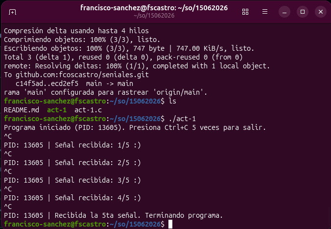

# Gestor de Señales SIGINT en C

Este programa demuestra cómo capturar y gestionar la señal `SIGINT` (generada al presionar `Ctrl+C`) en un entorno Linux, implementando un contador para finalizar la ejecución tras recibir exactamente 5 señales.

## Descripción
El programa utiliza `signal()` para redefinir el comportamiento por defecto de `SIGINT`. En lugar de terminar inmediatamente, el proceso incrementa un contador y notifica al usuario hasta alcanzar el umbral definido.

## Requisitos
* Sistema operativo tipo Unix/Linux.
* Compilador de C (GCC recomendado).

## Instalación y Ejecución

1. **Clonar o copiar el código**: Asegúrate de tener el archivo `.c` (por ejemplo, `manejador.c`).

2. **Compilar**:
   ```bash
   gcc -o manejador manejador.c
2. **Compilar**:
   ```bash
   ./manejador

## Evidencias de ejecución


