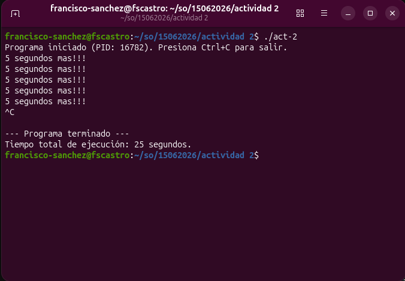

# Temporizador de Alarmas con Registro de Tiempo en C

Este programa muestra el uso de señales en Linux (`SIGALRM` y `SIGINT`) para gestionar eventos periódicos y realizar un seguimiento del tiempo total de ejecución.

## Descripción
El programa utiliza `alarm(5)` para generar un evento cada 5 segundos. Utiliza `pause()` para suspender el proceso eficientemente entre alarmas. Al recibir una señal de interrupción (`Ctrl+C`), el programa captura la señal, calcula el tiempo transcurrido desde su inicio y finaliza de manera controlada.

## Características
* **Gestión de `SIGALRM`**: Imprime un mensaje cada 5 segundos sin bloquear el CPU.
* **Cálculo de tiempo**: Utiliza la librería `<time.h>` para medir la duración de la ejecución.
* **Salida controlada**: Captura `SIGINT` (`Ctrl+C`) para mostrar el tiempo total antes de salir.

## Requisitos
* Sistema operativo tipo Unix/Linux.
* Compilador de C (GCC).

## Compilación y Ejecución

1. **Compilar**:
   ```bash
   gcc -o temporizador temporizador.c
2. **Ejecutar**:
   ```bash
   ./temporizador

## Evidencias de ejecución


