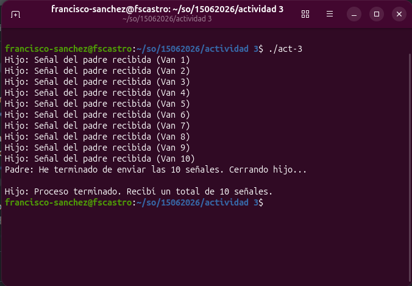

# Comunicación entre Procesos Padre e Hijo usando Señales

Este programa demuestra la comunicación básica entre procesos (IPC) en sistemas Unix/Linux utilizando la función `fork()` y señales.

## Descripción
El programa crea un proceso hijo a partir del proceso principal. El proceso padre actúa como un emisor, enviando exactamente 10 señales personalizadas (`SIGUSR1`) al proceso hijo (una cada segundo). El proceso hijo actúa como receptor, contabilizando las señales mediante un contador seguro. Al finalizar la ráfaga de 10 señales, el padre envía una señal de terminación (`SIGTERM`) para indicarle al hijo que debe mostrar el recuento total y finalizar su ejecución.

## Características
* **`fork()`**: Creación de la jerarquía de procesos padre e hijo.
* **`kill()`**: Envío de señales de un proceso a otro utilizando su PID.
* **`signal()`**: Configuración de manejadores de interrupciones personalizados para `SIGUSR1` y `SIGTERM`.
* **`pause()` y `sleep()`**: Eficiencia de CPU al pausar el hijo hasta recibir una señal, y controlar el ritmo de envío desde el padre.
* **`volatile sig_atomic_t`**: Uso de tipos atómicos para asegurar que el contador no se corrompa durante las interrupciones del manejador.

## Requisitos
* Sistema operativo tipo Unix/Linux.
* Compilador de C (por ejemplo, `gcc`).

## Compilación y Ejecución

1. **Guardar el código**: Guarda el código fuente en un archivo llamado `comunicacion.c`.
2. **Compilar**:
   ```bash
   gcc -o comunicacion comunicacion.c
   ```
3. **Ejecutar**:
   ```bash
   ./comunicacion
   ```
## Evidencia de ejecución

