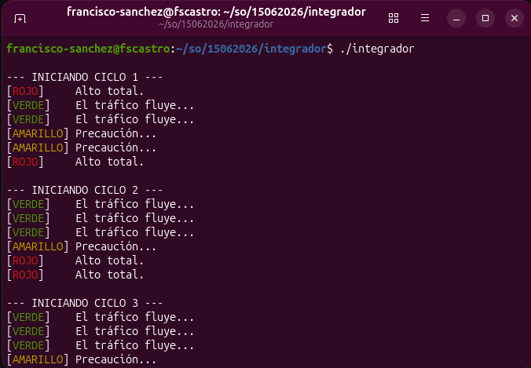

# Simulación de Semáforo con Procesos y Señales en C

Este programa implementa la simulación del comportamiento de un semáforo de tránsito utilizando programación de sistemas en Linux. Se aplica una arquitectura multiproceso donde un proceso padre actúa como el controlador del tiempo y un proceso hijo gestiona los estados del semáforo mediante el uso de señales.

## Descripción del Funcionamiento

El programa se divide en dos roles concurrentes tras ejecutar un `fork()`:

1. **El Proceso Hijo (Semáforo):** * Registra manejadores para capturar tres señales específicas: `SIGUSR1`, `SIGUSR2`, y `SIGINT`.
   * Al recibir `SIGUSR1`, cambia su estado a **VERDE**.
   * Al recibir `SIGUSR2`, cambia su estado a **AMARILLO**.
   * Al recibir `SIGINT` (sobrescribiendo el comportamiento nativo de `Ctrl+C`), cambia su estado a **ROJO**.
   * Ejecuta un bucle infinito imprimiendo continuamente el estado en la terminal utilizando códigos de escape ANSI para colorear el texto.

2. **El Proceso Padre (Controlador):**
   * Controla de manera secuencial los tiempos de cada fase del semáforo.
   * Envía las señales correspondientes al PID del hijo mediante la llamada al sistema `kill()`.
   * Simula 3 ciclos completos (Verde $\\rightarrow$ Amarillo $\\rightarrow$ Rojo) usando retardos con `sleep()`.
   * Al finalizar, envía una señal `SIGTERM` para terminar al hijo de forma controlada y ejecuta `wait()` para evitar dejar procesos zombie en el sistema.

## Requisitos

* Sistema Operativo basado en Unix/Linux.
* Compilador de C (`gcc`).

## Compilación y Ejecución

1. **Compilar el código fuente:**
   ```bash
   gcc -o semaforo semaforo.c
   ```

2. **Ejecutar**
   ```bash
   ./semaforo
   ```

## Evidencia de ejecución

